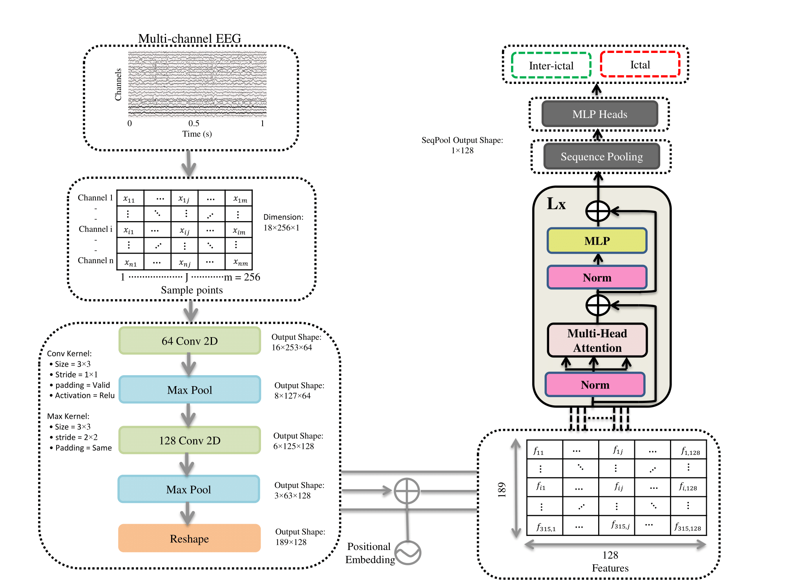

# Lightweight Convolution Transformer
Paper Link: [Lightweight convolution transformer for cross-patient seizure detection in multi-channel EEG signals
](https://doi.org/10.1016/j.cmpb.2023.107856))

By [Salim Rukhsar<sup>[1]</sup><span>&#42;</span>](https://www.linkedin.com/in/salim-rukhsar-10845282/),
[Anil K. Tiwari<sup>[1]</sup><span>&#42;</span>](http://home.iitj.ac.in/~akt/),

In association with Image Processing and Computer Vision Lab @ Indian Institute of Technology jodhpur<sup>[1]</sup>.

This repo contain pytorch implementation of Lightweight convolution transformer for cross-patient seizure detection in multi-channel EEG signals as explained in the [Lightweight convolution transformer](https://doi.org/10.1016/j.cmpb.2023.107856) paper. This Transformer architecture is from the Convolutioni for official implementation of this paper visit [here](https://github.com/SHI-Labs/Compact-Transformers)



# Citation
```bibtex
@article{RUKHSAR2023107856,
title = {Lightweight convolution transformer for cross-patient seizure detection in multi-channel EEG signals},
journal = {Computer Methods and Programs in Biomedicine},
volume = {242},
pages = {107856},
year = {2023},
issn = {0169-2607},
doi = {https://doi.org/10.1016/j.cmpb.2023.107856},
url = {https://www.sciencedirect.com/science/article/pii/S0169260723005229},
author = {Salim Rukhsar and Anil Kumar Tiwari},
}
```
